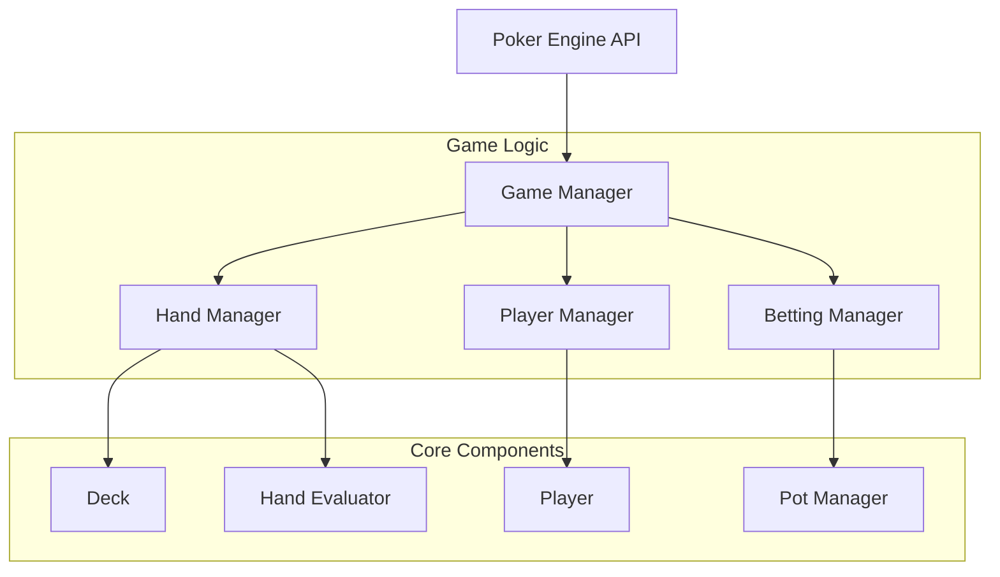

# Texas Hold'em Poker Engine Design

## Overview

The Texas Hold'em poker engine is designed as a modular, event-driven system that manages all aspects of poker gameplay. The engine follows object-oriented principles with clear separation of concerns, making it easy to integrate into various poker applications while maintaining game integrity and performance.

## Architecture

The engine uses a layered architecture with the following main components:



## Components and Interfaces

### 1. Card and Deck System

**Card Class:**
- Properties: suit, rank, value
- Methods: toString(), equals(), compare()

**Deck Class:**
- Properties: cards array, shuffled state
- Methods: shuffle(), deal(), reset(), remainingCards()

### 2. Hand Evaluation System

**HandEvaluator Class:**
- Static methods for evaluating poker hands
- Returns hand strength and ranking information
- Handles tie-breaking with kickers

**Hand Types (enum):**
- HIGH_CARD, PAIR, TWO_PAIR, THREE_OF_A_KIND, STRAIGHT, FLUSH, FULL_HOUSE, FOUR_OF_A_KIND, STRAIGHT_FLUSH, ROYAL_FLUSH

### 3. Player Management

**Player Class:**
- Properties: id, name, chips, cards, position, status
- Methods: bet(), fold(), check(), call(), raise()
- Status tracking: active, folded, all-in, eliminated

**PlayerManager Class:**
- Manages collection of players
- Handles position rotation and blind assignments
- Validates player actions

### 4. Betting System

**BettingManager Class:**
- Tracks current bet amounts and betting rounds
- Validates betting actions
- Manages betting sequence and turn order

**PotManager Class:**
- Handles main pot and side pot calculations
- Distributes winnings at showdown
- Manages all-in scenarios with multiple side pots

### 5. Game State Management

**GameManager Class:**
- Central coordinator for all game components
- Manages game phases and transitions
- Handles event emission and state queries

**GameState (enum):**
- WAITING, PREFLOP, FLOP, TURN, RIVER, SHOWDOWN, FINISHED

## Data Models

### Core Data Structures

```javascript
// Card representation
Card {
  suit: 'hearts' | 'diamonds' | 'clubs' | 'spades',
  rank: 'A' | '2' | '3' | ... | 'K',
  value: number // 2-14 (Ace high)
}

// Player state
Player {
  id: string,
  name: string,
  chips: number,
  cards: Card[],
  position: number,
  status: 'active' | 'folded' | 'all-in' | 'eliminated',
  currentBet: number,
  totalBet: number
}

// Game state
GameState {
  phase: 'waiting' | 'preflop' | 'flop' | 'turn' | 'river' | 'showdown',
  players: Player[],
  communityCards: Card[],
  pots: Pot[],
  currentPlayer: number,
  dealerPosition: number,
  smallBlind: number,
  bigBlind: number,
  minRaise: number
}

// Pot structure
Pot {
  amount: number,
  eligiblePlayers: string[], // player IDs
  isMainPot: boolean
}

// Hand evaluation result
HandResult {
  handType: HandType,
  strength: number,
  cards: Card[], // best 5-card hand
  kickers: Card[]
}
```

## Error Handling

### Validation Strategy
- Input validation at API boundaries
- Business rule validation in managers
- State consistency checks before state transitions

### Error Types
- `InvalidActionError`: Player attempts invalid action
- `InsufficientChipsError`: Player doesn't have enough chips
- `GameStateError`: Action not valid in current game state
- `PlayerNotFoundError`: Reference to non-existent player

### Error Response Format
```javascript
{
  success: false,
  error: {
    type: 'InvalidActionError',
    message: 'Cannot raise when not enough chips',
    details: { required: 100, available: 50 }
  }
}
```

## Testing Strategy

### Unit Testing
- Individual component testing (Card, Deck, HandEvaluator)
- Player action validation
- Hand evaluation accuracy
- Pot calculation correctness

### Integration Testing
- Complete hand scenarios from start to finish
- Multi-player betting rounds
- Side pot calculations with multiple all-ins
- Edge cases (heads-up play, single player remaining)

### Test Data
- Predefined card combinations for hand evaluation testing
- Scripted player actions for betting scenario testing
- Edge case scenarios (all players fold, multiple all-ins)

## Performance Considerations

### Optimization Areas
- Hand evaluation caching for identical card combinations
- Efficient card shuffling algorithm
- Minimal object creation during gameplay
- Event batching for UI updates

### Memory Management
- Object pooling for cards and temporary objects
- Cleanup of completed hands
- Efficient data structures for large player counts

## API Design

### Core Methods
```javascript
// Game initialization
createGame(config: GameConfig): GameEngine
addPlayer(player: PlayerConfig): boolean
startGame(): boolean

// Player actions
playerAction(playerId: string, action: Action): ActionResult
getGameState(): GameState
getPlayerState(playerId: string): PlayerState

// Game progression
dealCards(): boolean
advancePhase(): boolean
evaluateHands(): HandResult[]

// Event system
on(event: string, callback: Function): void
emit(event: string, data: any): void
```

### Event System
- `gameStarted`: Game begins
- `cardsDealt`: Cards distributed to players
- `playerAction`: Player takes action
- `phaseChanged`: Game phase transitions
- `handComplete`: Hand finished, winnings distributed
- `gameEnded`: Game concluded